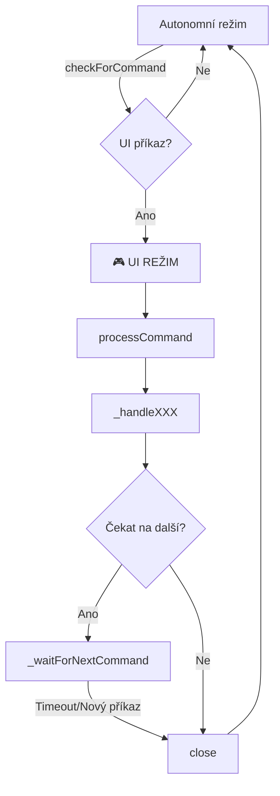

# UIBot README

## 📂 Umístění

`~/ivy/iv_ui.class.js`

## 🌟 Účel

Třída `UIBot` zajišťuje **zpracování UI příkazů z webového rozhraní** a umožňuje správci přerušit autonomní činnost robota pro ruční ovládání.

➡️ **Bypass logika**: UI příkazy mají vždy prioritu před autonomním režimem
➡️ **Přepínání režimů**: Přeruší běžnou činnost a přepne do UI režimu
➡️ **Konzistentní architektura**: Navržena podle vzoru FBBot

## 🎮 Podporované UI příkazy

| Příkaz       | Popis                                         | Data parametry              |
| ------------ | --------------------------------------------- | --------------------------- |
| `print`      | Vypíše zprávu do logu                        | `{message: string}`         |
| `restart`    | Restartuje celý proces                       | `{}`                        |
| `pause`      | Pozastaví činnost na X minut                 | `{min: number}`             |
| `call_user`  | Přihlásí konkrétního uživatele               | `{user_id: number}`         |
| `user_group` | Přihlásí uživatele a otevře skupinu          | `{user_id: number, group_id: number}` |

## 🏗️ Základní použití

```javascript
import { UIBot } from './iv_ui.class.js';

// Kontrola UI příkazů
const uiBot = new UIBot();
const command = await uiBot.checkForCommand();

if (command) {
  // Zpracování příkazu
  const success = await uiBot.processCommand(command);
  console.log(`Příkaz ${command.command} dokončen:`, success);
}

await uiBot.close();
```

## 🔄 Integrace do hlavního cyklu

UIBot je integrován do `iv_worker.js` s **bypass logikou**:

```javascript
export async function tick() {
  // 🎯 PRIORITA 1: UI příkazy (přeruší vše ostatní)
  const uiBot = new UIBot();
  const uiCommand = await uiBot.checkForCommand();

  if (uiCommand) {
    Log.info('[WORKER]', '🎮 UI REŽIM aktivován');
    await uiBot.processCommand(uiCommand);
    return; // Ukončí tick, zajistí čistý restart
  }

  // 🎯 PRIORITA 2: Běžný autonomní režim
  Log.debug('[WORKER]', '🤖 AUTONOMNÍ REŽIM');
  // ... běžná logika robota
}
```

## 📊 Databázová struktura

```sql
CREATE TABLE `ui_commands` (
  `id` bigint(20) unsigned NOT NULL AUTO_INCREMENT,
  `host` varchar(15) NOT NULL,           -- hostname VM (Ubuntu-6B)
  `command` varchar(15) NOT NULL,        -- typ příkazu
  `data` longtext CHARACTER SET utf8mb4, -- JSON parametry
  `created` timestamp DEFAULT current_timestamp(),
  `accepted` timestamp NULL DEFAULT NULL, -- kdy bot převzal
  `fulfilled` varchar(1) DEFAULT '0',     -- 0=čeká, 1=dokončeno
  PRIMARY KEY (`id`)
) ENGINE=InnoDB DEFAULT CHARSET=utf8mb4;
```

## 🔑 Hlavní metody

| Metoda                         | Popis                                    |
| ------------------------------ | ---------------------------------------- |
| `checkForCommand()`            | Zkontroluje UI příkazy pro tento host   |
| `processCommand(command)`      | Zpracuje konkrétní UI příkaz             |
| `close()`                      | Zavře všechny zdroje                     |

## 🔧 Private metody (interní)

| Metoda                         | Popis                                    |
| ------------------------------ | ---------------------------------------- |
| `_handlePrint(data)`           | Zpracuje print příkaz                    |
| `_handleRestart(command)`      | Zpracuje restart příkaz                  |
| `_handlePause(data)`           | Zpracuje pause příkaz                    |
| `_handleCallUser(data)`        | Zpracuje call_user příkaz                |
| `_handleUserGroup(data)`       | Zpracuje user_group příkaz               |
| `_initializeBrowser(userId)`   | Inicializuje browser a FBBot      |
| `_waitForNextCommand(timeout)` | Čeká na další UI příkaz                  |
| `_cleanup()`                   | Vyčistí všechny zdroje                   |

## 🎯 Workflow příkladů

### Příklad 1: Ruční přihlášení uživatele
```json
{
  "host": "Ubuntu-6B",
  "command": "call_user",
  "data": "{\"user_id\": 64}"
}
```
**Výsledek**: Robot přeruší autonomní režim, přihlásí uživatele 64 a čeká na další příkazy

### Příklad 2: Otevření specifické skupiny
```json
{
  "host": "Ubuntu-6B",
  "command": "user_group",
  "data": "{\"user_id\": 64, \"group_id\": 123}"
}
```
**Výsledek**: Přihlásí uživatele 64, otevře skupinu 123 a čeká na další příkazy

### Příklad 3: Pauza na 30 minut
```json
{
  "host": "Ubuntu-6B",
  "command": "pause",
  "data": "{\"min\": 30}"
}
```
**Výsledek**: Pozastaví veškerou činnost na 30 minut

## 🔄 Stavy a životní cyklus



## ⚠️ Důležité poznámky

### 🎯 Priorita UI příkazů
- UI příkazy **vždy přeruší** běžný autonomní režim
- Po dokončení UI příkazu se cyklus **restartuje čistě**
- Zajišťuje okamžitou odezvu na požadavky správce

### 🔧 Správa zdrojů
- Každý UI příkaz má vlastní browser instanci
- Automatické cleanup po dokončení
- Timeout ochrana proti "visícím" příkazům

### 🏠 Host-based routing
- Příkazy jsou směrovány podle `hostname` sloupce
- Jeden příkaz = jeden konkrétní VM
- Umožňuje paralelní ovládání více VM

## 🔗 Zpětná kompatibilita

Pro zachování kompatibility se starým kódem:

```javascript
// Deprecated - použijte UIBot třídu
export async function checkUI() {
  const uiBot = new UIBot();
  return await uiBot.checkForCommand();
}

export async function solveUICommand(command) {
  const uiBot = new UIBot();
  try {
    return await uiBot.processCommand(command);
  } finally {
    await uiBot.close();
  }
}
```

## 🚀 Výhody nové architektury

✅ **Okamžitá odezva** - UI příkazy mají nejvyšší prioritu
✅ **Čistá separace** - UI režim vs autonomní režim
✅ **Robustní cleanup** - Automatická správa zdrojů
✅ **Timeout ochrana** - Chrání proti visícím příkazům
✅ **Konzistentní API** - Stejný vzor jako ostatní Bot třídy
✅ **Zpětná kompatibilita** - Starý kód funguje

## 🎮 Použití z webového rozhraní

Webové rozhraní (PHP) vkládá příkazy do `ui_commands` tabulky:

```php
// Příklad PHP kódu pro vložení UI příkazu
$host = 'Ubuntu-6B';
$command = 'user_group';
$data = json_encode(['user_id' => 64, 'group_id' => 123]);

$sql = "INSERT INTO ui_commands (host, command, data) VALUES (?, ?, ?)";
$stmt = $pdo->prepare($sql);
$stmt->execute([$host, $command, $data]);
```

Robot automaticky detekuje nový příkaz a přepne do UI režimu během několika sekund.
